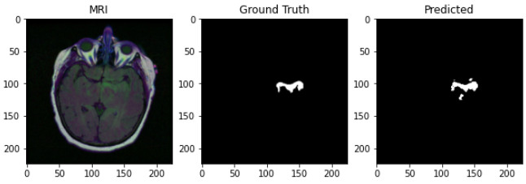
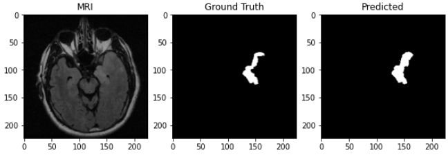
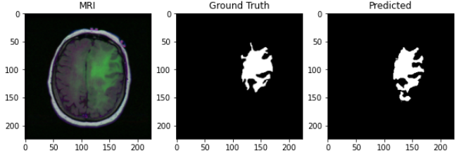

## Brain Tumor Segmentation using MRI-Mask pairs with UNet

### Data

-  The dataset used in the model can be found [here](https://www.kaggle.com/datasets/mateuszbuda/lgg-mri-segmentation).
-  The dataset is restructured into two folders
    - MRI (Containing the MRI scans)
    - Mask (Containing the corresponding segmentation masks)
-  The scans and the masks correspond to each other by having the same file name in the two folders.

### Model
- The Model used in this project is [UNet](https://arxiv.org/abs/1505.04597).
-  The size of the input is 224 x 224 x 3, and the output is 224 x 224 x 1.
- The Pre-trained weights can be downloaded from [here](https://drive.google.com/drive/folders/1tM1LiTmOOMvsl6cCMf8HJmCpp1aL-p_l?usp=sharing).
- Optimizer: `Adam`
- Loss: `BCEWithLogits`

### Results
- Here are the prediction results obtained from the model.

